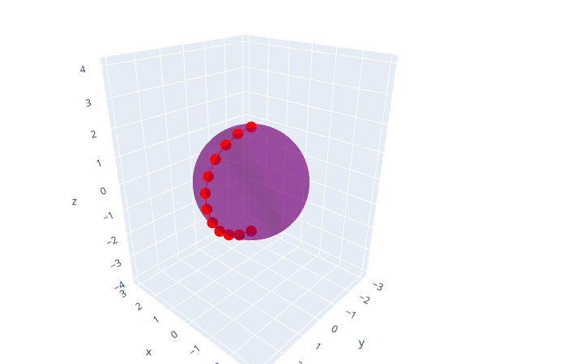

# Genetic Shortest Path


**Vídeo do projeto:** https://youtu.be/IUDgSsGRKuA 


## Objetivos

Obtenção de um conjunto abitrário de coordenadas dentro do menor caminho entre dois pontos em uma superfície no $\mathbb{R}^3$ (geodésica). 

O cálculo analítico das geodésicas é normalmente obtido por cálculo variacional, pela minimização do funcional

$$
I = \int_A^B dS
$$

que representa o comprimento do caminho entre os pontos $A$ e $B$. Esse mesmo método é comumente usado também, de modo mais geral, para a minimização de ação (Lagrangeana) para se determinar o movimento de corpos em mecânica, pro exemplo. 

De modo mais geral, podemos escrever para um caminho parametrizado:

$$
I[F] = \int_{x_1}^{x_2} F(x, y, \frac{dy}{dx}) dx
$$

o que pode ser minimizado pela equação de *Euler-Lagrange*:

$$
\frac{\partial F}{\partial y} - \frac{d}{dx}(\frac{\partial F}{\partial y'}) = 0
$$

Desta forma, de modo geral, mesmo para a obtenção de uma estimativa do melhor caminho em uma superfície arbitrária métodos numéricos para equações diferenciais se fazem necessários.

Buscaremos evitar fazer isso, bem como outros métodos de geometria diferencial, modelando nosso problema como a otimização de uma função de perda escolhida estratégicamente.



## Métodos

Os pontos são obtidos da seguinte forma:

1. Um conjunto de $n$ pontos igualmente espaçados é gerado entre dois pontos $A$ e $B$ selecionados na superfície desejada.

2. São gerados $m$ elementos ("partículas") somando um ruído aleatório com distribuissão normal $N(\mu=0, \sigma=0.1)$ aos pontos, afim de gerar uma pequena variabilidade inicial.

3. Buscamos minimizar a função de perda $\Gamma$ (ou maximizar o *fitness* $\frac{1}{\Gamma}$) definida por:

$$
\Gamma = \mu_1 l + \mu_2 \sum^{n+1}_{i=1} |(l_i - \overline{l})| + \mu_3 \sum^{n}_{i=1} |f(x_i, y_i, z_i)|
$$

$$
l = \sum_{i=1}^{n+1} l_i
$$

$$
\overline{l} = \frac{l}{n+1}
$$

em o primeiro termo está relacionado com o comprimento total entre os pontos, o segundo com a distância dos pontos entre si, e o último com a distância dos pontos à superfície.

Os parâmetros $mu_1, \mu_2$ e $\mu_3$ foram escolhidos empíricamente como $0.8, 2.2$ e $1.5$, respectivamente. 

4. Afim de maximizar o *fitness*, em cada geração ordenaremos as partículas e separaremos as $k$ melhores (escolhido pelo usuário) para gerarem as demais pela mistura dos seus pontos interiores entre si (crossover) e adição de ruído gaussiano (mutação).

## Uso

Para instalar requisitos:

```{shell}
$ pip3 install -r requirements.txt
```

Para testar com o arquivo de exemplo:

```{shell}
$ python3 lazypeon.py
```

Para abrir página interativa:

```{shell}
$ python3 interactive.py
```

e acessar `http://127.0.0.1:8050/` no navegador.